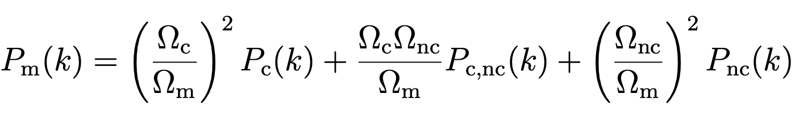

# The Non-linear Power Spectrum with axionHMcode

axionHMcode is a code to compute the non-linear matter power spectrum in a mixed dark matter cosmology with an ultra-light axion (ULA) component of the dark matter as described in https://arxiv.org/abs/2209.13445. A very accurate halo model for a LCDM or massive neutrino cosmology is given by [Mead et al.](https://arxiv.org/abs/2009.01858) by the 'HMcode'. Since this model uses some of the fitting parameters and is inspired by this ode the presented code is named after 'HMcode'.

## Theory

The model computes the non-linear power spectrum by using the fully expanded power spectrum

The cold part can be computed as usually with the standard halo model (see [Massara et al.](https://arxiv.org/abs/1410.6813) or [Mead et al.](https://arxiv.org/abs/2009.01858)). In contrast, the cross and axion parts have to take into account the non clustering of axions on small scales due to free-streaming. This is done by splitting the axion overdensity into a clustered and linear component. For details see [Massara et al.](https://arxiv.org/abs/1410.6813) where the same full treatment was used for massive neutrinos, but can be translated to any other warm/hot, i.e. free streaming / (partially) non-clustering, matter component. 

## How Does the Code Work?

The code expected an input file as given in "input_file.txt" and an executable 'axionCAMB' program named ./camb . The code works for an axion mass range of [10^-28 eV, 10^-21 eV] and at the moment for a fraction of 10% axions of the total dark matter. 

An example python file is given in "example_file.py". To run the file you have to change the ‘input_file_path’ and the ‘axionCAMB_exe_path’ (complete path). If the paths are not correct the python code will produce an error message. Besides the non-linear total matter power spectrum, the example file also computes the non-linear power spectrum in a LCDM cosmology where the axion density is transformed into CDM density. Both power spectra are saved in a file named as given by the variable "datafile_path". The units of the wavenumber and the power spectra are h/Mpc and (Mpc/h)^3 respectively. The code also produces a plot of the ratio between the MDM and LCDM linear and non-linear power spectra.

The total computation time is around 4 minutes. The time is much longer than e.g. the HMcode since the code has to compute some axion halo parameters for which no fitting functions are given and thus has to compute for each halo individually (see my paper https://arxiv.org/abs/2209.13445 or ask me, if you have a question about it). 

## Code Modifications

The axionHMcode can also use some parameters from the 'HMcode' in [Mead et al.](https://arxiv.org/abs/2009.01858) which improve the predictions in the case of a LCDM cosmology with massive neutrinos. The parameters can switch on by setting the corresponding parameters to True or False in the function for the non-linear power spectrum. The parameters are the smoothing parameters, alpha, the halo bloating term, eta_given, the one halo damping on large scales, one_halo_damping and the two halo damping on large scales, two_halo_damping. By default, only the one halo damping is switched on, because on large scales the non-linear power spectrum should be equal to the linear which is given by the two halo term and thus the one halo term has to be damped on large scales (see [Mead et al.](https://arxiv.org/abs/2009.01858) for details).  

## Added Features
The updated version of axionHMCode is based Numba for increased speed. It also includes optional parameters alpha_1, alpha_2, gamma_1, gamma_2 defined in arXiv:2111.01199 Eq. (36). To use them, just include them in your dictionary of cosmological parameters (the "cosmo_dic" file) before running the "params" and "power spectra" calculation using e.g. cosmo_dic['alpha_1'] = X. They are not yet inculded in the input file.

## Contact data

If you find any bugs or have any questions with respect to the code, please send me a message via github or open an issue.

