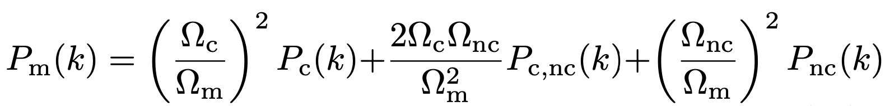

# axionHMcode

`axionHMcode` is a code to compute the non-linear matter power spectrum in a mixed dark matter cosmology with an ultra-light axion (ULA) component of the dark matter as described in [Vogt et al. (2022)](https://arxiv.org/abs/2209.13445). A very accurate halo model for &Lambda;CDM and massive neutrino cosmologies is given in [Mead et al. (2020)](https://arxiv.org/abs/2009.01858), referred to as `HMCode-2020`. Since the `axionHMcode` model is inspired by their code and uses some of their fitting parameters, our model is named after `HMcode`. More recently, the code was updated and calibrated to simulations in [Dome et al. (2024)](https://arxiv.org/abs/2409.11469).

## Theory

The model computes the non-linear power spectrum by using the fully expanded power spectrum

The cold part can be computed as usually with the standard halo model (see [Massara et al. (2014)](https://arxiv.org/abs/1410.6813) or [Mead et al. (2020)](https://arxiv.org/abs/2009.01858)). In contrast, the cross and axion parts have to take into account the non clustering of axions on small scales due to free-streaming. This is done by splitting the axion overdensity into a clustered and linear component. For details see [Massara et al. (2014)](https://arxiv.org/abs/1410.6813) where the same full treatment was used for massive neutrinos, but can be translated to any other warm/hot, i.e. free streaming/(partially) non-clustering, matter component. 

## How Does the Code Work?

The code expects an input file called `input_file.txt` which contains information about the cosmology in the style of a Python dictionary. Alternatively, one can also provide the corresponding dictionary directly. Have a look into `load_cosmology.py` to see what information has to be stored in this dictionary. At the least, the linear matter power spectrum for the target cosmology broken down into different components such as, axions, CDM and baryons saved in a dictionary is needed (see example notebook for the structure). If the linear matter power spectrum is not available, the built-in wrapper to `axionCAMB` can be used. In other words, if you have a working `axionCAMB` executable, the code can directly compute the linear power spectrum for the cosmology as specified by `input_file.txt`.

An example Python file is given in `example_file.py`. To run the file you have to change the `input_file_path` and the `axionCAMB_exe_path` fields (provide the complete path). If the paths are not correct the code will produce an error message. Besides the non-linear total matter power spectrum, the example file also computes the non-linear power spectrum in a &Lambda;CDM cosmology where the axion density is transformed into CDM density. Both power spectra are saved to a file, whose name can be set by the user via the `datafile_path` variable. The units of the wavenumber and the power spectra are $h/\mathrm{cMpc}$ and $\left(\mathrm{cMpc}/h\right)^3$ respectively. The code also produces a plot of the ratio between the MDM and &Lambda;CDM linear and non-linear power spectra.

Moreover, for consistency the example notebook makes a comparison to `HMcode-2020` in the &Lambda;CDM case. A comparison is made using the implementation in `CAMB` and the Python package `hmcode`.

## HMCode-2020 Parameters

The `axionHMcode` can also use the parameters from `HMCode-2020` in [Mead et al. (2020)](https://arxiv.org/abs/2009.01858) which improves the predictions in the case of a CDM cosmology with massive neutrinos. The parameters can be switched on by setting the corresponding variables to `True` or `False` in the function for the non-linear power spectrum (make sure the parameters are consistent in the different functions). The parameters are the smoothing parameters, `alpha`, the halo bloating term, `eta_given`, the one-halo damping on large scales, `one_halo_damping`, and the two-halo damping on large scales, `two_halo_damping`.

Since these parameters are not calibrated to mixed axion - cold dark matter cosmologies, we suggest to not use them in the base version.

## Code Updates including calibration from [Dome et al. (2024)](https://arxiv.org/abs/2409.11469)

[Dome et al. (2024)](https://arxiv.org/abs/2409.11469) presented an improved version of `axionHMcode`, which introduced new parameters calibrated to MDM simulations.

Moreover, several updates were made to speed up the code. The changes are summarised in the following:

1. The axion mass - cold mass relation, $M_a(M_c)$, is now modelled as a broken power law (see Eq. 51 in [Dome et al. (2024)](https://arxiv.org/abs/2409.11469)) which ensures the old relation of $M_a(M_c) = (\Omega_a/\Omega_c) M_c$ is satisfied above a defined cut-off mass. This new relation is inspired by simulations and is calibrated by them in the redshift range $1 < z < 8$ and for axion fractions of $0.01 < f_{\mathrm{ax}} = \Omega_{\mathrm{ax}} / \Omega_{\mathrm{m}} < 0.3$ around the pivot axion mass $m_a=10^{-24.5}$ eV.
2. [Dome et al. (2024)](https://arxiv.org/abs/2409.11469) introduced new smoothing parameters $\alpha$ for the cold-cold power spectrum and the cross-power spectrum which depend on the axion mass and axion density. The exact form of these parameters was calibrated to the MDM simulations in the redshift range $1 < z < 8$ and for axion fractions of $0.01 < f_{\mathrm{ax}} = \Omega_{\mathrm{ax}} / \Omega_{\mathrm{m}} < 0.3$ around the pivot axion mass $m_a=10^{-24.5}$ eV.
3. The two-halo term is now calculated by the linear power spectrum only. The difference between this and the total two-halo term is minor and the speed up is increased. There is still the option to use the full two-halo term by setting the parameter `full_2h = True`, but note that the calibrations were performed with `full_2h = False`. 
4. A bug in the cold density profile when using the halo bloating term $\eta$ was corrected.
5. The relations for the critical density threshold, $\delta_c$, and the virial overdensity, $\Delta_{\mathrm{vir}}$, are now calculated as in `HMCode-2020` (see [Mead et al. (2020)](https://arxiv.org/abs/2009.01858), Eq. A1 and A2). This ensures that `axionHMcode` and `HMCode-2020` agree in the case of a &Lambda;CDM cosmology.
6. The minimum concentration is now $B=5.196$ as found in [Mead et al. (2020)](https://arxiv.org/abs/2009.01858).
7. Alex Laguë implemented Numba in this updated version to increase the speed of the code.
8. Alex Laguë and Keir Rogers also included the optional parameters `alpha_1`, `alpha_2`, `gamma_1`, `gamma_2` defined in [Dentler er al. (2021)](https://arxiv.org/abs/2111.01199), Eq. (36). To use them, just include them in your dictionary of cosmological parameters (the `cosmo_dic` file) before running the `params` and `power spectra` calculation using e.g. `cosmo_dic['alpha_1'] = X`. They are not yet included in the input file.

Both the base version and calibrated version from [Dome et al. (2024)](https://arxiv.org/abs/2409.11469) can be used. To distinguish, set the parameter `version` in the input file to `basic` or `dome`, respectively. 

When using the calibrated version from [Dome et al. (2024)](https://arxiv.org/abs/2409.11469), one has to take into account the redshift range, the axion fraction as well as the axion mass for which the model was calibrated. Therefore, we only recommend to use the `dome` version when $1 < z < 8$, $0.01 < f_{\mathrm{ax}} = \Omega_{\mathrm{ax}} / \Omega_{\mathrm{m}} < 0.3$ and for axion masses that are close to the pivot mass $m_a=10^{-24.5}$ eV. In addition, in the `dome` version, we recommend to use `alpha = True` and `concentration_param = True`.

## Contact data

If you find any bugs or have any questions about the code, please send me a message via GitHub or open an issue.
